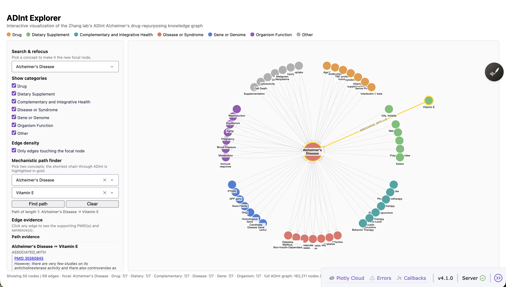
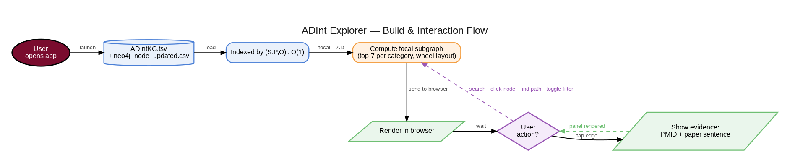
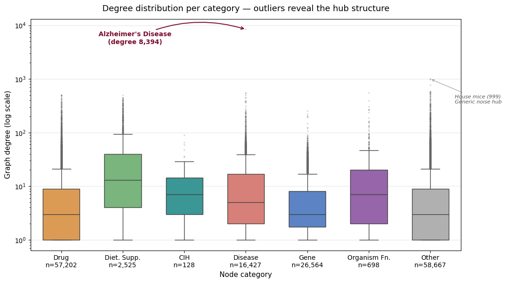
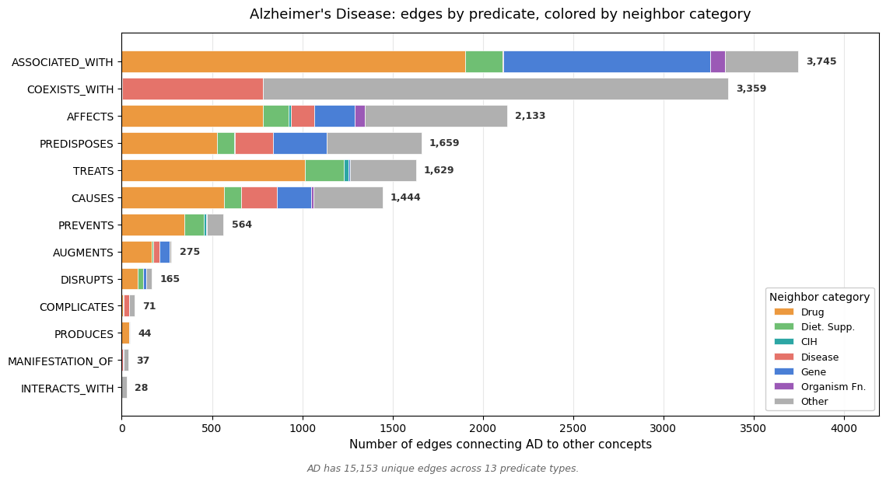

# ADInt Explorer

[](https://colab.research.google.com/github/YOUR-USERNAME/adint-explorer/blob/main/notebooks/ADInt_Explorer.ipynb)

An interactive visualization dashboard for the **ADInt knowledge graph** : the Alzheimer's drug-repurposing knowledge graph from Xiao et al., *Scientific Reports* 2024. Built as the final project for HINF 5620 at the University of Minnesota.

> **Recommended way to explore this project:** click the *Open in Colab* badge above. The notebook walks through the full pipeline from raw data files to live interactive dashboard, with structured headings and a clickable Table of Contents.



## What it does

The Zhang lab's ADInt knowledge graph contains over a million literature-extracted relationships between drugs, dietary supplements, complementary health interventions, diseases, and genes — with Alzheimer's Disease at its center. The published artifact is a static tab-separated file. **ADInt Explorer is the interactive interface that turns it into a navigable research instrument.**

Four core features:

- **Search & refocus** : type any of the 162,000 concepts; the graph re-centers around it instantly.
- **Category filters** : toggle the seven Zhang lab categories on or off; rare types like CIH always survive thanks to per-category stratification.
- **Mechanistic path finder** : pick any two concepts; NetworkX computes the shortest chain through 742,000 edges in under a second and highlights it in gold.
- **Evidence panel** : click any edge to surface the **exact source sentence** behind every triple, with a clickable PubMed link. Every connection traces back to literature.

## How to run

### Recommended: Google Colab (no installation)

Click the *Open in Colab* badge at the top of this README. The notebook contains the full pipeline:

1. Section 1 installs dependencies and mounts your Google Drive
2. Section 2 lets you point at your data folder
3. Sections 3–10 walk through the data pipeline, exploratory visualizations, and app construction
4. Section 11 launches the live dashboard and prints a clickable URL

Total time after the first cell: ~1 minute including data load.

### Alternative: Run locally

```bash
git clone https://github.com/YOUR-USERNAME/adint-explorer.git
cd adint-explorer
pip install -r requirements.txt

# Download data from the Zhang lab repository:
# https://github.com/zhang-informatics/ADInt
# Place ADIntKG.tsv and Neo4j_node_updated.csv in the project root,
# preserving the Neo4j_data/ subfolder.

python app.py
# Open http://127.0.0.1:8050 in your browser
```

## Repository structure

```
adint-explorer/
├── app.py                         Standalone Dash application
├── generate_slides.py             Builds the project presentation deck
├── requirements.txt               Pinned dependencies
├── notebooks/
│   └── ADInt_Explorer.ipynb       RECOMMENDED: full walkthrough notebook
├── figures/
│   ├── screenshot_dashboard.png
│   ├── fig_architecture_flowchart.png
│   ├── fig_degree_by_category_with_outliers.png
│   └── fig_ad_neighborhood_structure.png
├── README.md
└── LICENSE
```

## Architecture

The system has two phases. **Build phase** runs once at startup: load the source files, deduplicate triples, build a NetworkX graph, and pre-index evidence by `(subject, predicate, object)` for O(1) edge-click lookups. **Interaction loop** runs on every user action: search, click, path-find, or filter triggers a recomputation of a small focal subgraph (top-7 neighbors per category) which is then sent to the browser for rendering.



## Design rationale

The visualization design is grounded in *Dashboard Vision* (Yang et al., *IEEE TVCG* 2025). Four guidelines applied:

- **L1 — stratified layout** → category-wedge wheel guarantees rare types appear in every view
- **O2 — big numbers as primary focal points** → live counts in the status bar
- **O1 + O4 — subtitles and inline labels drive deepest attention** → source sentence placed directly beside the edge it explains
- **L3 — simplified groupings** → focal-only edge filter reduces clutter ~63% by default

## Knowledge graph structure

Two visualizations from the notebook (Section 6) explain why the design works the way it does:

| | |
|---|---|
|  |  |
| Long-tailed degree distribution per category — Alzheimer's Disease at degree 8,394 dominates | AD's edges by predicate × neighbor category — `PREVENTS` is sparse (~4%); CIH is barely visible |

## Data

This tool requires the published ADInt knowledge graph data, available at [github.com/zhang-informatics/ADInt](https://github.com/zhang-informatics/ADInt). The data files are **not** included in this repository.

## Citation

If you use this tool in research, please cite the underlying ADInt paper:

> Xiao, Y., Hou, Y., Zhou, H., Diallo, G., Fiszman, M., Wolfson, J., Zhou, L., Kilicoglu, H., Chen, Y., Su, C., Xu, H., Mantyh, W. G., & Zhang, R. (2024). Repurposing non-pharmacological interventions for Alzheimer's disease through link prediction on biomedical literature. *Scientific Reports*, 14, 8693. [doi:10.1038/s41598-024-58604-8](https://doi.org/10.1038/s41598-024-58604-8)

## Future directions

- **Predicate-based filtering** — let users hide correlative predicates (`ASSOCIATED_WITH`, `COEXISTS_WITH`) to focus on therapy and causation claims
- **DrKGC integration** — overlay the Zhang lab's R-GCN link-prediction confidence scores as edge weights
- **Evidence depth filter** — show only edges supported by ≥ N PubMed papers
- **ClinicalTrials.gov annotation** — flag intervention nodes in active Alzheimer's trials
- **Public deployment** — host on Render or Hugging Face Spaces for browser-only access

## Author

Aviral Bhatnagar · Health Informatics PhD · University of Minnesota · [bhatn042@umn.edu](mailto:bhatn042@umn.edu)

## License

MIT — see [LICENSE](LICENSE).